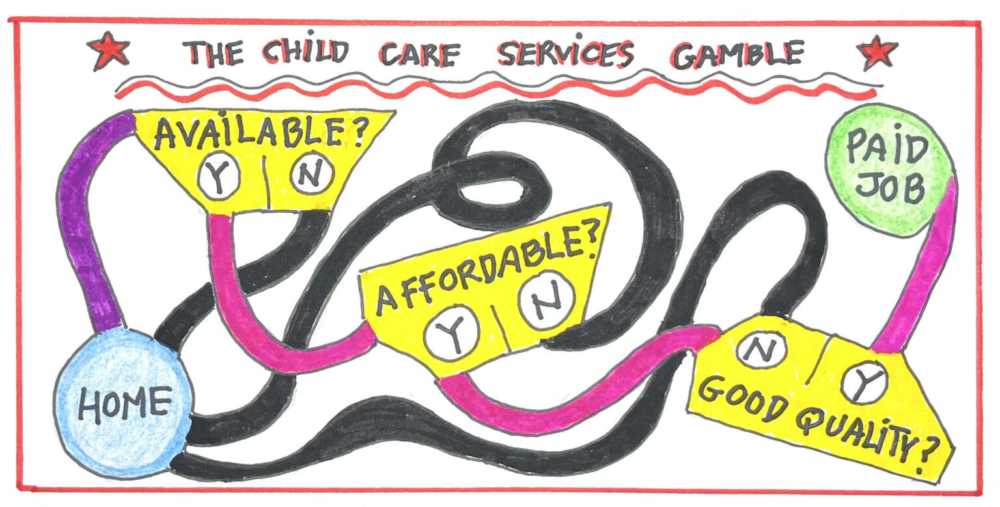

# PhD dissertation 
**Singing to my Drug Lord: the Effects of Drug Cartels on Local Employment Structure** 

> Draft coming soon!

  
 Abstract 
 
   
  <blockquote>
    This work analyzes the impact of drug trafficking organizations on the local structure of  employment in Mexican municipalities between 2005 and 2017. I create a panel of municipalities combining information from employment surveys and a dataset of cartel presence identified from web content. The empirical strategy relies on difference-in-differences and instruments cartel presence with a measure of the popularity of drug ballads or corridos using searches from Google Trends data. The results show that the effects of cartel presence differ from those expected from creating a legal firm in the tradable sector as predicted by economic theory. Cartel presence does not affect overall employment levels, but reduces the average wage and affects the structure of local employment by increasing the share of employment in agriculture and reducing the share of services, mostly driven by transportation and other services. While these results would suggest a reallocation of employment towards less productive activities, their interpretation is still unclear given that cartel presence also decreases the likelihood that households sampled for the survey are interviewed, mostly because the units are unoccupied or the residents deny the interview. 
  </blockquote>
 

 

---

**Growing Up Around Cartels: Salience of Criminal Careers and Youth's Education Choices in Mexico**

---

# Other projects 

**[Filling the Gaps: Childcare Laws for Women’s Economic Empowerment](https://elibrary.worldbank.org/doi/abs/10.1596/1813-9450-10492)** With [S Anukriti](https://sites.google.com/view/s-anukriti/home){:target="_blank"} , [Lelys Dinarte-Diaz](https://sites.google.com/view/lelys-dinarte/home){:target="_blank"} , Marina Elefante and Alena Sakhonchik. 

  
 Abstract 
 
   
  <blockquote>
    This paper aims to provide global evidence on whether and what attributes of laws governing the provision of childcare services affect women's labor market outcomes. It merges country-year-level data from the World Bank's Women, Business and the Law database, which documents childcare laws across countries, with data on women's labor force participation from ILOSTAT. Using a difference-in-difference estimation framework, the analysis finds that the enactment of childcare laws increases women's labor force participation by 2 percent, on average. Moreover, the effect increases over time, reaching up to 4 percent five years after an enactment. This effect is driven by women who are married, have completed less than primary education, and are between the ages of 35 and 44. Lastly, regulation of the availability and affordability of childcare has a similar impact on female labor force participation, whereas the effect of quality regulation is smaller.
  </blockquote>
 

 

*[Blog post](https://www.revaluingcare.org/can-child-care-legislation-increase-womens-participation-in-the-paid-labor-force/) in the Care Talk Blog* 

*[Blog post](https://blogs.worldbank.org/impactevaluations/childcare-regulation-and-womens-participation-labor-force) in the World Bank Development Impact Blog*

---

**Mitigating Poverty: Global Estimates of the Impact of Income Support during the Pandemic.** With Johanna Fajardo-Gonzalez, George Gray Molina, and Eduardo Ortiz-Juarez.

*R&R at Oxford Development Studies.*

---

**[Moral Force: Leaders' Actions and Social Distancing](https://papers.ssrn.com/sol3/papers.cfm?abstract_id=3678980){:target="_blank"}**  *with [L. Guillermo Woo-Mora](woomora.github.io){:target="_blank"} and [Federico Daverio-Occhini].*

[*UNDP LAC Working Paper*](https://www-dev.undp.org/latin-america/publications/moral-force-leaders%E2%80%99-actions-and-social-distancing){:target="_blank"} 

--- 

**It’s raining kids! The labor market effects of unexpected school closures.** With Lucile Dehouck and Romaine Loubes.

---
