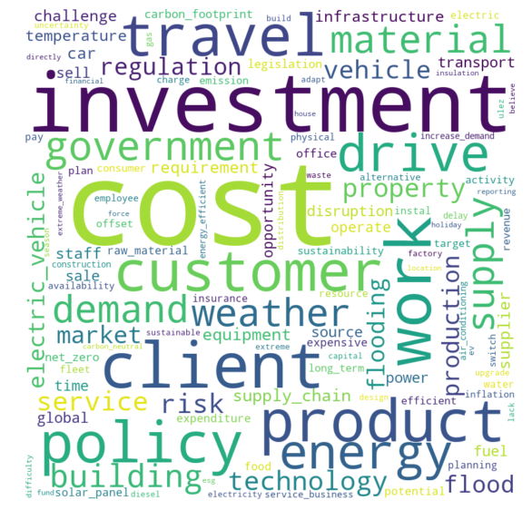
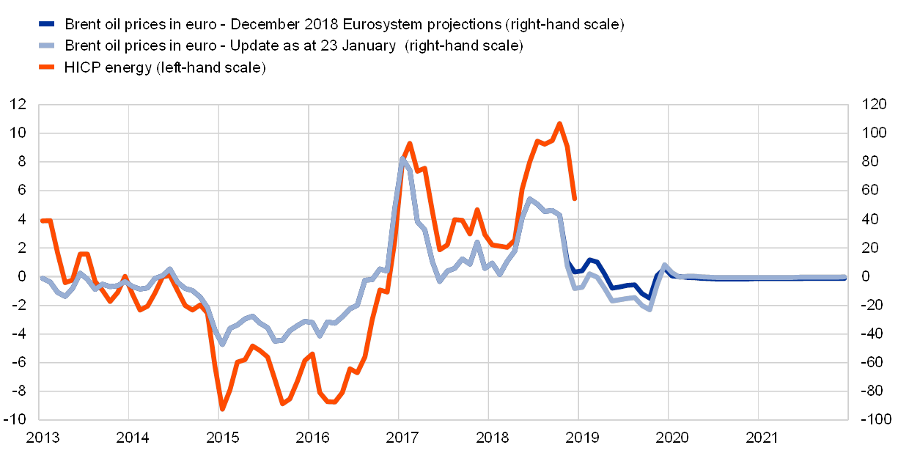

# Work in Progress
**Firm Climate investments: Evidence from the UK** 

> Draft coming soon!

  
 Abstract 
 
   
  <blockquote>
    We analyse climate investment expectations using a large survey of UK firms. Firms expect climate-related investments to account for 5.4\% of their total capital expenditure over the next three years, an increase from 2.5\% over the past three years. Around two-thirds of these investments are expected to be in additional to normal capital expenditures, with some firms investing less elsewhere. Climate investments are expected mainly in switching to green energy sources and improving energy efficiency, and firms expect to finance these mainly using internal cash reserves. Climate investments will driven by larger firms as well as those in more energy-intensive sectors.
  </blockquote>
 

 

**Wage and Inflation Expectations and Role of Uncertainty** With [Philip Schnattinger]([[https://karlwhelan.com/blog/]){:target="_blank"}.

> Draft coming soon!

  
 Abstract 
 
   
  <blockquote>
    In this paper, we study the heterogeneous effects of individual-level uncertainty of prices on individual wage expectations decisions using the FRBNY Survey of Consumer Expectations. We focus on the transmission of the first (level) and second moment (uncertainty) of expected inflation on the level of wage expectations during uncertain times and how these differ along the income distribution. We find that individual-level expected inflation uncertainty is positively correlated with wage expectations. Moreover, higher inflation uncertainty is linked to a greater rise in wage expectations for poorer households. We explain this observation with a novel mechanism: workers precautiously bargain for higher wages when uncertainty about inflation risks the erosion of their real wages. Thus inflation uncertainty may be an additional driver of wage growth, especially for lower-income workers. 
  </blockquote>
 

 

---

# Working papers

**[Oil Prices and Inflation Forecasts](https://www.ucd.ie/economics/t4media/WP23_27.pdf)** With [Karl Whelan](https://karlwhelan.com/blog/){:target="_blank"} , [Constantin Burgi](https://sites.google.com/view/cburgi/home){:target="_blank"}.
R and R JMCB

  
 Abstract 
 
   
  <blockquote>
    We examine how people's forecasts for oil prices influence their forecasts for broader inflation. Despite debate in the literature about whether consumers place too much weight on oil prices when
    making inflation predictions, we provide further confirmation for the results of Binder (2018), suggesting a low response to oil price forecasts, roughly consistent with the share of energy in the
    US CPI or somewhat below. In contrast, we show that the participants in the ECB's Survey of Professional Forecasters and the Wall Street Journal survey of economists place too little weight on oil
    prices when making their inflation forecasts.
  </blockquote>
 

 

---

